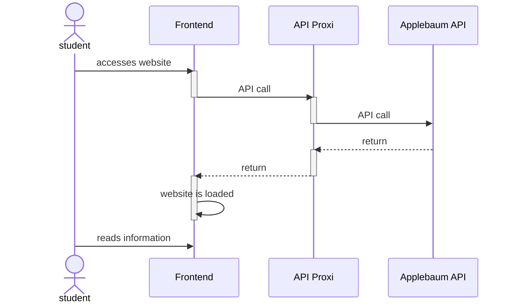
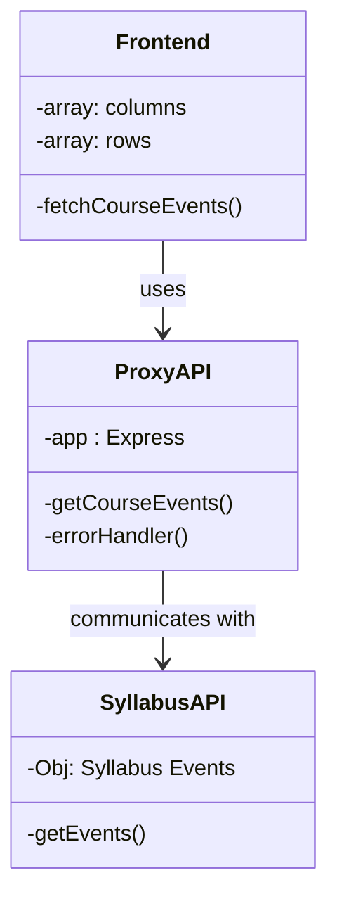

# Architecture Overview

The backend has local environment variables for the API key and url. The frontend makes an API call to the locally hosted backend to grab the syllabus information. The backend then uses the API key and URL to make an API call to Applebaum's syllabus server to relay the information.

# Use Cases

1. A student checks if there is an event today
2. Browse all events for the remainder of the semester

# Class Diagram

